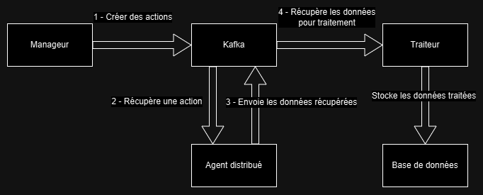
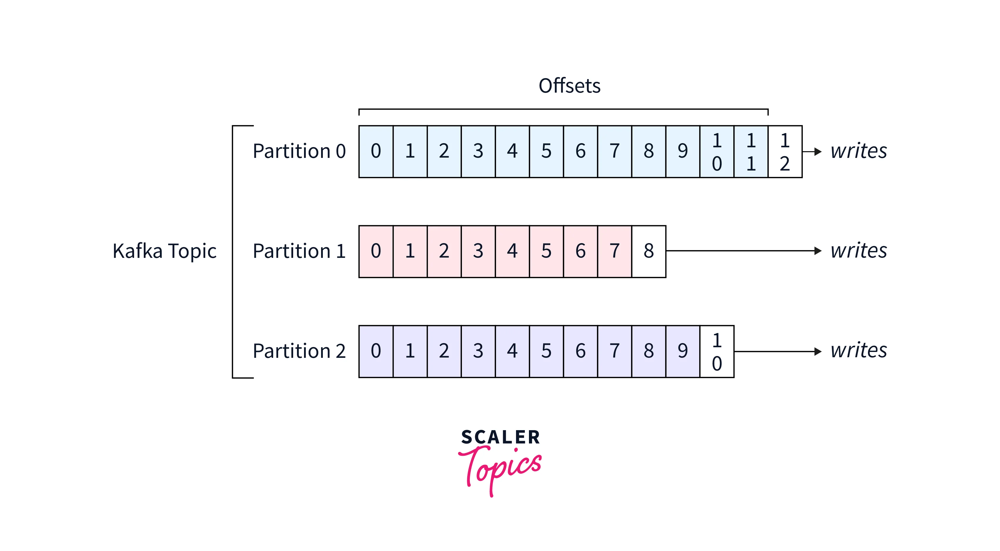
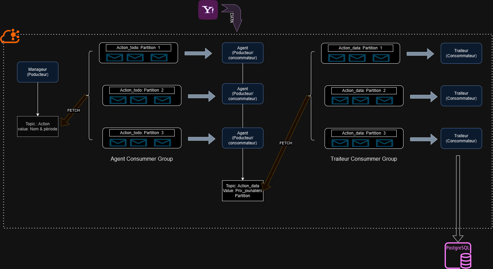

# Distributed Financial Processing

## 🏗️ Projet : Systèmes Distribués pour le Traitement des Données

### 📌 Présentation
Ce projet a été réalisé par une équipe de **6 étudiants**, répartis en **3 groupes de 2** :
- **Développement logiciel et infrastructure**
- **Cluster Kubernetes et gestion du déploiement**
- **Site Reliability Engineering (SRE)**

🚀 **Ce dépôt concerne la partie développement logiciel**, qui inclut la conception de l’architecture logicielle, l’implémentation des microservices et leur intégration avec Kafka et PostgreSQL.  
🚀 **Il inclut également les services Kubernetes et le déploiement des applications**.

💡 **L’architecture de ce projet a été pensée et réalisée par [FelinaeBlanc](https://github.com/FelinaeBlanc) sur GitHub. Une autre personne a contribué à sa mise en œuvre, mais j’ai été l’architecte principal.**

Nous avons conçu un **système distribué** permettant le **traitement et l’analyse de données financières**. Il démontre la capacité d’une architecture distribuée à traiter de **grandes quantités d’informations** avec **scalabilité** et **résilience**.

---

## 🎯 Objectif Principal
Mettre en œuvre un **système distribué** capable d’analyser et de traiter efficacement des **données financières**.

### 🔹 Étapes Principales
1. **Récupération des données brutes**  
   📌 Collecte des valeurs d’un grand nombre d’actions (*symboles*) depuis diverses sources.

2. **Traitement des données**  
   📌 Analyse des données pour calculer des indicateurs techniques tels que le **RSI (Relative Strength Index)** et d’autres métriques financières.

3. **Stockage des résultats**  
   📌 Centralisation des données traitées dans une **base de données PostgreSQL** pour une exploitation future et une visualisation structurée.

---

## 🏗️ Présentation de l’Architecture

### 🔹 Vue Générale

### 🔹 Prérequis
✅ **Garantir l’ordre de traitement** des calculs d’analyses techniques pour les actions.  
✅ **Répartition dynamique des partitions** via **Kafka**.

### 🔹 Gestion des Partitions (Kafka)

- **Kafka déployé en cluster distribué** sur plusieurs nœuds pour assurer la **scalabilité et la tolérance aux pannes**.
- **Kafka répartit automatiquement les partitions entre les consommateurs d’un groupe** :
  - 📌 Nouveau consommateur → partitions redistribuées.
  - 📌 Consommateur défaillant → partitions réassignées.
  - 📌 Une partition = un seul consommateur par groupe → **ordre de traitement garanti**.

### 🔹 Organisation de l'Architecture

📌 **Modules Clés** :
- **Manager** (Producteur Kafka) → Génère des tâches sous forme d’actions contenant le symbole d'une action et une période à traiter. Ces tâches sont envoyées dans un topic Kafka nommé `Stock_topic`, réparties entre plusieurs partitions pour permettre un **traitement parallèle et scalable**.
  - 🔹 **Utilise PostgreSQL (table `symbol_state`)** pour mémoriser la dernière date traitée de chaque symbole afin d’éviter les doublons et faciliter la reprise en cas de panne.

- **Agents** (Producteurs/Consommateurs Kafka) → Récupèrent les tâches (`Stock_topic`) et utilisent **l’API YFinance** pour collecter les **données journalières** des actions. Ces données sont ensuite envoyées dans un second topic Kafka nommé `Stock_data_topic`.
  - 🔹 **Consommateurs appartenant au même Consumer Group**, permettant une gestion dynamique de la charge.
  - 🔹 **Assurent la répartition des tâches** entre plusieurs instances pour une scalabilité optimale.

- **Traiteurs** (Consommateurs Kafka) → Récupèrent les **données brutes** depuis `Stock_data_topic` et appliquent des traitements spécifiques comme le **calcul des indicateurs techniques** (**RSI, MACD, etc.**). Les résultats traités sont ensuite stockés dans **PostgreSQL**.
  - 🔹 **Chaque traiteur traite une partition dédiée pour garantir l’ordre des calculs**.

### 🔹 Stockage des Données
La base de données **PostgreSQL** joue un rôle central en tant que **stockage pérenne** des résultats traités. Elle permet :
- Une organisation structurée des données.
- Des requêtes SQL avancées pour l’exploitation et l’analyse.

---

## 🚀 Technologies Utilisées

### 🔹 Langage Principal
- **Python 3** : Développement des microservices avec une riche bibliothèque pour l’analyse et manipulation de données.

### 🔹 Bibliothèques Clés
- **Pandas** : Manipulation et traitement des données financières via **DataFrames**.
- **Pandas-TA** : Calcul des indicateurs techniques (**RSI, MACD, etc.**).

### 🔹 Accès aux Données
- **YFinance** : API fiable pour récupérer l’historique des valeurs boursières avec des données **structurées et mises à jour régulièrement**.

### 🔹 Communication Interservices
- **Confluent-Kafka** :
  - Déployé en cluster **distribué** pour assurer **scalabilité, tolérance aux pannes et haute disponibilité**.
  - Gestion efficace des messages dans un environnement distribué.
  - Assure **découplage des services**, **tolérance aux pannes** et **scalabilité horizontale**.

### 🔹 Base de Données
- **PostgreSQL** :
  - Stockage robuste des résultats (**données brutes et indicateurs techniques**).
  - Performances optimales pour les **requêtes complexes**.

### 🔹 Conteneurisation et Orchestration
- **Docker** :
  - Exécution uniforme et **portabilité** des services sur tous les environnements.
  - Simplification du **déploiement et de la maintenance**.
- **Kubernetes** :
  - Orchestration des services pour garantir **scalabilité** et **haute disponibilité**.
  - Déploiement automatisé des **microservices et bases de données**.
  - **Utilisation d’Auto-Scaling avec Keda** pour une gestion dynamique des ressources.

---

## 🔥 Améliorations et Optimisations

### 🔹 Passage à Kubernetes
✅ **Déploiement sous un cluster Kubernetes**  
✅ Migration d’une **configuration locale** vers une **configuration pour Google Cloud Platform (GCP)**

### 🔹 Auto-Scaling avec Keda
✅ Configuration dynamique avec un **équilibreur de charge** pour adapter automatiquement le nombre de services.

### 🔹 Amélioration de la Résilience du Manager
✅ **Stockage de la dernière date traitée** pour chaque symbole afin d'éviter la **création d’actions en double** même en cas de panne.

---

📌 **Cette architecture garantit la modularité, la scalabilité et la fiabilité nécessaires pour gérer efficacement le traitement des données financières à grande échelle.** 🚀